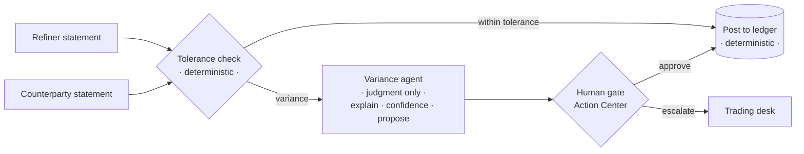

# Exchange Recon · Ops Cockpit

Live operations cockpit for the **Maestro Exchange Settlement Reconciliation** process.
It reads running Maestro instances, surfaces the ones where the variance agent has
flagged a mismatch, shows the agent's proposed correction, and lets an operator clear
the **human gate** (approve the correction or escalate to the trading desk) without
leaving the app.

This is the human-in-the-loop surface for the agentic process. The orchestration,
agents, and audit trail run on the UiPath Platform; this app is the window into them.

> **Watch it:** the ~3-minute demo run-of-show is in [DEMO.md](./DEMO.md).

## Business impact

Settlement variances are reconciled by hand today — slow, inconsistent, and every
unresolved hour is $ exposure. On a representative exchange desk (assumptions in
[BUSINESS-CASE.md](./BUSINESS-CASE.md)): **~87% less time per variance**, **~560
analyst-hours/year recovered**, and millions in settlement exposure cleared in
minutes instead of hours — with the agent doing judgment only, never the posting.

## What it does

- Lists live instances of the Exchange Recon process (polls every 8s).
- Flags instances needing a human: faulted, paused, or pending approval.
- Opens a variance drawer per instance: the agent's variance, confidence, and proposed
  correction, pulled from instance variables, plus the full variable set.
- Completes the linked Action Center task with the operator's decision.

## How it flows



## The split that matters

The design keeps three kinds of work strictly separate — that separation is the
point, not a limitation:

- **Deterministic** (Business Rule / RPA): the tolerance check and the ledger
  posting. Reconciliation math is never an LLM.
- **Agent** (judgment only): reads two mismatched statements, explains the
  variance, scores its confidence, proposes a correction. It never posts and
  never moves money.
- **Human** (authority): approves the correction or escalates to the trading
  desk. This cockpit is where that decision happens.

## UiPath components used

| Component | Used for |
| --- | --- |
| UiPath Maestro (Process Instances API) | live instance list, status, variables, execution history |
| UiPath Action Center (Tasks API) | the human approval gate (`complete` the task) |
| UiPath Data Fabric (Entities API) | open positions and counterparty statements (demo data) |
| UiPath TypeScript SDK `@uipath/uipath-typescript` | all of the above, via modular imports |

## Agent type & track

**Track:** UiPath Maestro BPMN (Track 2) — a predictable, end-to-end process
orchestrating deterministic rules, a judgment agent, and a human gate.

**Agent type:** Combination. At runtime, Maestro BPMN sequences deterministic
Business Rules, the variance (judgment) agent, and the Action Center human gate.
The solution was **built with a coding agent** — Claude Code, through UiPath for
Coding Agents — with verifiable evidence in [CODING-AGENTS.md](./CODING-AGENTS.md).

## Prerequisites

- Node.js 18+
- A UiPath Automation Cloud tenant with Maestro enabled
- An OAuth **External Application** (Admin -> External Applications -> Non Confidential)
  with redirect URI `http://localhost:5173` and scopes matching `.env`

## Setup

```bash
npm install
cp .env.example .env      # fill in client id, org, tenant, folder
npm run dev               # http://localhost:5173
```

Sign in with UiPath, and the cockpit connects to your tenant.

## Coding agents (UiPath for Coding Agents)

This project's UiPath automation side was built with **Claude Code** using the official
UiPath agent skills:

```bash
npm i -g @uipath/cli
uip skills install --agent claude   # installs UiPath skills into Claude Code
uip login                            # authenticate the CLI to your tenant
```

The skills give the coding agent the domain knowledge to build, run, test, and deploy
the Maestro process and the coded variance agent from the terminal.

See [CODING-AGENTS.md](./CODING-AGENTS.md) for documented, verifiable evidence of the
coding-agent contribution — commits, artifacts, and how to reproduce the checks.

## Preview-API seams

A few shapes vary by tenant/configuration on the preview APIs. They are marked in code:

- `src/lib/exchange.ts` `findOpenTaskForInstance` — confirm the field that links an
  Action Center task to a Maestro instance against a real task payload.
- `decideGate` — align the `data` keys with your User task's outcome form fields.
- `getInstanceVariables` — variable container shape is normalized defensively.

## Submission checklist

- [x] Build green (`npm run build`), repo clean, MIT licensed, no secrets or branding.
- [x] Demo run-of-show written ([DEMO.md](./DEMO.md)).
- [ ] Record the ~3-min demo — stage one instance parked at the human gate first.
- [ ] Flip this repo public: `gh repo edit --visibility public --accept-visibility-change-consequences`.
- [ ] Submit to AgentHack with the video link.

## License

MIT. See [LICENSE](./LICENSE).
