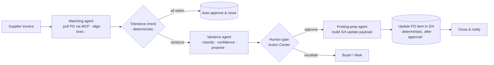

# Agentic P2P Reconciliation · UiPath Maestro × live SAP S/4HANA (MCP)

A governed, **multi-agent Procure-to-Pay reconciliation** on **UiPath Maestro BPMN** where the
agents reason over the **real SAP system of record**. They pull live purchase orders from
**S/4HANA over MCP**, reconcile an inbound supplier invoice against them, classify the
discrepancies, and prepare a correction for a human to approve. The agents only ever *read* SAP;
the correction is human-approved and held at the gate — **armed, not fired.**

> **Watch it:** the demo run-of-show is in [DEMO.md](./DEMO.md).

## What makes it different

Most agent demos reconcile synthetic data. This one queries **live SAP S/4HANA Cloud** through an
MCP server. The agent calls the SAP OData MCP's `execute-entity-operation` to read the real
purchase-order line items (`A_PurchaseOrderItem` — material, order quantity, net price, currency),
reconciles a supplier invoice against them, and proposes the correction. Real system of record,
real data, governed by a human gate.

The proof it's real: give the agent only the *supplier's* numbers and it still reports the *PO*
side correctly — because it fetched the PO from S/4 at runtime, not from its input.

## Three governed agents

Maestro orchestrates three coded LangGraph agents (`uipath-langchain`), each connected to S/4 over
MCP via `langchain-mcp-adapters` with XSUAA client-credentials:

| Agent | Role | Reads S/4 | Writes S/4 |
| --- | --- | --- | --- |
| **matching-agent** | pulls the live PO, aligns supplier lines to PO items by material | ✅ | ❌ |
| **variance-agent** | classifies each discrepancy (price-variance, quantity-variance, over-delivery, material-mismatch, …), scores confidence, proposes a correction | ✅ | ❌ |
| **posting-prep-agent** | turns the human-approved correction into a precise `A_PurchaseOrderItem` update payload (reads the current value for the audit trail) | ✅ | ❌ |

## The split that matters

Three kinds of work, strictly separate — that separation is the point:

- **Deterministic** (Business Rule / script): the tolerance check on each line's price/quantity.
- **Agent** (judgment, read-only): pull, match, classify, propose. **Never writes to SAP.**
- **Human** (authority): approves the correction or escalates to the buyer. The cockpit is where
  that decision happens.

The write-back — the S/4 `update A_PurchaseOrderItem` PATCH — runs only **after** the human
approves. The agents prepare it; a deterministic step executes it. It posts nothing on its own.

## How it flows



## MCP → SAP S/4HANA

The agents reach S/4 through a SAP OData MCP server (hosted on SAP BTP). It exposes a generic
OData explorer — `search-sap-services`, `discover-service-entities`, `get-entity-schema`,
`execute-entity-operation` (read / create / update) — so an agent can discover the right service
and entity and operate on it. Here the agents use `API_PURCHASEORDER_PROCESS_SRV` /
`A_PurchaseOrderItem`.

Connection details (URL + XSUAA client-credentials) come from the environment (UiPath assets in
prod, a gitignored `.env` locally) — **no secret is committed**. In production the MCP is
registered in **Orchestrator → MCP Servers → Remote**, so UiPath holds the connection and the
agents reach SAP through their UiPath identity.

## UiPath components used

| Component | Used for |
| --- | --- |
| UiPath Maestro BPMN | the long-running, governed orchestration of the three agents + the human gate |
| UiPath Coded Agents (LangGraph, `uipath-langchain`) | the three judgment/retrieval agents |
| Model Context Protocol (MCP) | the agents' live, read-only connection to SAP S/4HANA OData |
| UiPath Action Center | the human approval gate |
| UiPath TypeScript SDK `@uipath/uipath-typescript` | the operations cockpit |

## Agent type & track

**Track:** UiPath Maestro BPMN (Track 2) — a predictable, end-to-end process orchestrating a
deterministic rule, three judgment agents, and a human gate.

**Agent type:** Combination — Maestro BPMN sequences a deterministic Business Rule, the three coded
agents, and the Action Center human gate. The solution was **built with a coding agent** — Claude
Code, through UiPath for Coding Agents — with verifiable evidence in
[CODING-AGENTS.md](./CODING-AGENTS.md).

## Repo layout

```
matching-agent/        coded agent — pull PO + align lines (MCP → S/4)
variance-agent/        coded agent — classify variances + propose correction (MCP → S/4)
posting-prep-agent/    coded agent — approved correction → S/4 update payload (MCP → S/4)
ExchangeReconSolution/ the Maestro BPMN process (the orchestration)
src/                   the operations cockpit (Vite + React + TS)
specs/                 requirements / design / tasks
```

## Run an agent against live S/4

Each agent is a standard UiPath coded agent. With `.env` filled (`SAP_MCP_URL` + XSUAA
`SAP_MCP_CLIENT_ID` / `SAP_MCP_CLIENT_SECRET` / `SAP_MCP_TOKEN_URL`, plus `uipath auth` for the LLM
gateway):

```bash
cd variance-agent
uv run uipath run agent -f input.json     # pulls the real PO over MCP and reconciles
```

`input.json` is a purchase-order number + a supplier document. See each agent's `.env.example`.

## Built with a coding agent

The automation was built with **Claude Code** using the official UiPath agent skills:

```bash
npm i -g @uipath/cli
uip skills install --agent claude
uip login
```

See [CODING-AGENTS.md](./CODING-AGENTS.md) for verifiable evidence — commits, artifacts, reproduction.

## License

MIT. See [LICENSE](./LICENSE).
